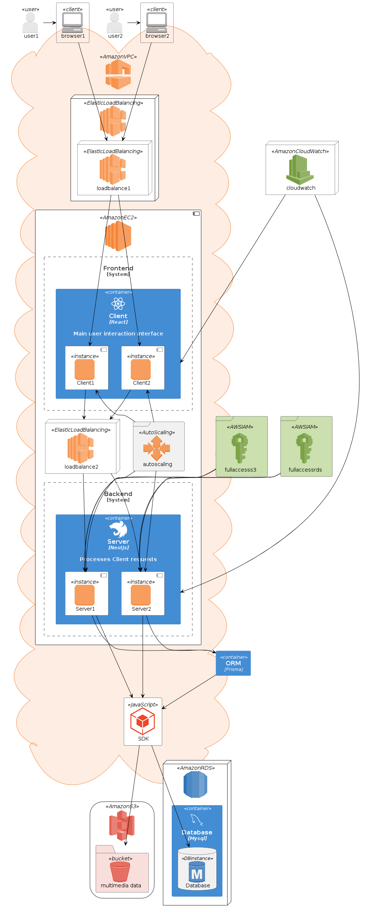

## Arquitetura

Esta seção apresenta uma visão geral da arquitetura de software da aplicação "Simple Box". Descreve os principais componentes, camadas e interações entre componentes da aplicação, fornecendo uma compreensão geral da estrutura e organização do sistema.

## Componentes

A aplicação segue o modelo de implantação em nuvem, utilizando para isso frameworks de implementação e serviços presentes na Amazon Web Services (AWS). Os componentes estão divididos da seguinte forma:

**View:** Esta camada lida com as requisições vindas do navegador do cliente, tendo a função de interface e ponto de interação com os usuários. Composta por instâncias da Amazon Elastic Compute Cloud ([EC2](https://docs.aws.amazon.com/pt_br/AWSEC2/latest/UserGuide/concepts.html)), que hospedam os templates React em JavaScript com definições de layouts e estruturas renderizadas na interface da aplicação.

**Controller:** Esta camada realiza o despacho dos pedidos feitos pelo lado do cliente para os serviços corretos na camada de modelo e devolve essas respostas de volta ao cliente. Implementada em arquivos de extensão ".controller" nos módulos da aplicação.

**Model:** É onde se encontram as classes que representam as entidades que fazem parte do domínio da aplicação, podendo conter suas lógicas de negócio, estado e interagir com o banco de dados para operações de leitura e escrita persistente. Para essa aplicação, utiliza-se o Amazon Simple Storage Service ([Amazon S3](https://aws.amazon.com/pt/pm/serv-s3/)) e o Amazon Relational Database Service ([Amazon RDS](https://docs.aws.amazon.com/pt_br/AmazonRDS/latest/UserGuide/Welcome.html)) com [MySQL](https://www.mysql.com/downloads/) integrado ao ORM  [Prisma](https://www.prisma.io/docs/getting-started)para simplificar implementações de banco de dados, respectivamente, para armazenamento dos objetos multimídia a serem gerenciados pela aplicação e dados dos usuários e desses objetos. Implementações dessa camada, assim como da camada Controller da aplicação, também estão contidas em instâncias [EC2](https://docs.aws.amazon.com/pt_br/AWSEC2/latest/UserGuide/concepts.html) da Amazon.
### Diagrama de componentes

## Funcionamento da Aplicação

As requisições feitas pelos usuários antes de qualquer interação com os componentes do lado do cliente são distribuídas pelo serviço [AWS Elastic Load Balancing](https://docs.aws.amazon.com/pt_br/elasticloadbalancing/latest/userguide/what-is-load-balancing.html) entre as instâncias EC2 destinadas à comunicação com o usuário. Isso contribui para o balanço de carga, desempenho, escalabilidade e disponibilidade da aplicação. Após essas requisições serem dirigidas à instância adequada, ocorre o repasse para as instâncias EC2 com atividades do lado do servidor implementadas, sendo esse repasse também intermediado pelo Elastic Load Balancing.

Todas essas instâncias EC2 são monitoradas pelo [Amazon CloudWatch](https://docs.aws.amazon.com/pt_br/AmazonCloudWatch/latest/monitoring/WhatIsCloudWatch.html). A partir desses dados, são baseadas as ações feitas pelo [Amazon EC2 Auto Scaling](https://docs.aws.amazon.com/pt_br/autoscaling/ec2/userguide/what-is-amazon-ec2-auto-scaling.html), serviço da nuvem Amazon responsável pelo ajuste na quantidade de instâncias e recursos para instâncias EC2, visando a manutenção de desempenho e disponibilidade da aplicação.

As operações e o gerenciamento envolvendo todos os recursos da Amazon são simplificados pelo uso da SDK JavaScript, que abstrai os detalhes, tornando o desenvolvimento eficiente e programático. Isso permite manter o foco na codificação das funcionalidades que acrescentam valor à aplicação.

As estruturas de armazenamento persistente Amazon S3 e Amazon RDS são acessadas pelas instâncias do lado do servidor para operações de leitura e escrita. Tais operações têm permissões definidas no Amazon Identity and Access Management ([IAM](https://aws.amazon.com/pt/iam/)), com condições de acesso padrão na criação das políticas para o S3 e RDS. O mapeamento necessário para manipulações de dados do banco de dados é feito pelo Prisma em comunicação com o SDK, que é responsável tanto pela interação direta com o banco de dados MySQL quanto com o Amazon S3 presente na nuvem.