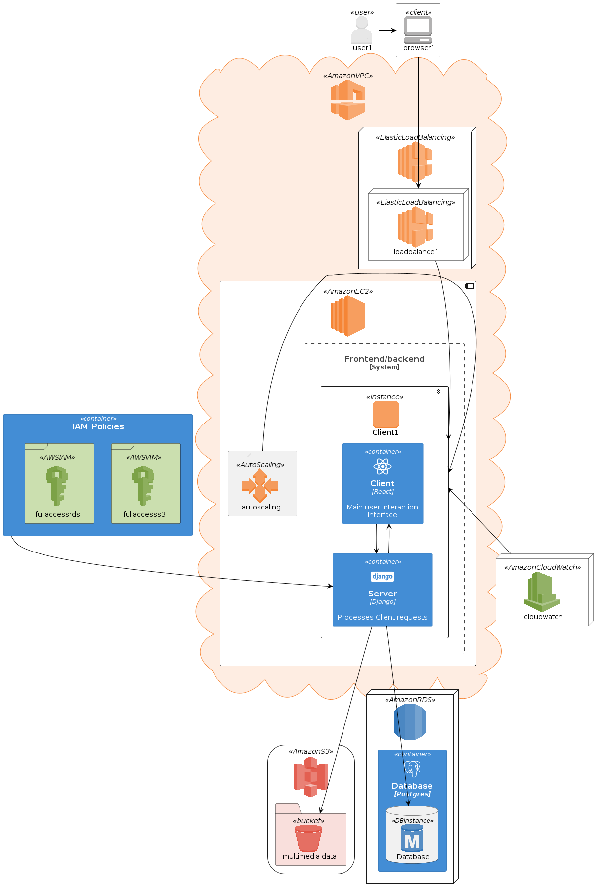

## Arquitetura

Esta seção apresenta uma visão geral da arquitetura de software da aplicação "Simple box". Descreve os principais componentes, camadas e interações entre componentes da aplicação, fornecendo uma compreensão geral da estrutura e organização do sistema.

## Componentes

A aplicação segue o modelo de implantação em nuvem, utilizando para isso frameworks de implementação e serviços presentes na Amazon Web Services (AWS). Os componentes estão divididos da seguinte forma:

**View:** Esta camada lida com as requisições vindas do navegador do cliente, tendo a função de interface e ponto de interação com os usuários.Composta por instâncias da Amazon Elastic Compute Cloud ([EC2](https://docs.aws.amazon.com/pt_br/AWSEC2/latest/UserGuide/concepts.html)), que hospedam os templates React em JavaScript com definições de layouts e estruturas renderizadas na interface da aplicação.

**Controller:** Esta camada realiza o despacho dos pedidos feitos pelo lado do cliente para os serviços corretos na camada de modelo e devolve essas respostas de volta ao cliente. Implementada em arquivos de extensão ".controller" nos módulos da aplicação.

**Model:** É onde se encontram as classes que representam as entidades que fazem parte do domínio da aplicação, podendo conter suas lógicas de negócio, estado e interagir com o banco de dados para operações de leitura e escrita persistente. Para essa aplicação, utiliza-se o Amazon Simple Storage Service ([Amazon S3](https://aws.amazon.com/pt/pm/serv-s3/)) e o Amazon Relational Database Service ([Amazon RDS](https://docs.aws.amazon.com/pt_br/AmazonRDS/latest/UserGuide/Welcome.html)) com [MySQL](https://www.mysql.com/downloads/) integrado ao ORM  [Prisma](https://www.prisma.io/docs/getting-started) para ,respectivamente, armazenamento de objetos multimídia e armazenamento de dados de usuários e desses objetos.

## Funcionamento da Aplicação

**Acesso do usuário**
 As Requisições feitas pelo usuário ocorrem na aplicação por meio de sua interação com instâncias EC2 [React](https://react.dev/learn/installation) em execução na Amazon Virtual Private Cloud(VPC) para serem encaminhadas a instâncias do lado servidor.
 
**Balanceamento de carga**
Todas o acesso a instâncias React da aplicação e requisições que partem destas para as instâncias EC2 [Nestjs](https://docs.nestjs.com/first-steps) em execução no lado servidor são, antes de qualquer interação com esses componentes, distribuídas pelo serviço [AWS Elastic Load Balancing](https://docs.aws.amazon.com/pt_br/elasticloadbalancing/latest/userguide/what-is-load-balancing.html) de forma a se atingir um balanço de carga entre as instâncias ativas,contribuindo para o desempenho, escalabilidade e disponibilidade da aplicação.

**AutoScaling**
Em casos mais extremos em que o balanço for detectado como  insuficiente(aplicação atingir acima de 80% da capacidade de processamento ou RAM do servidor principal) nos dados fornecidos pelo serviço de monitoramento [Amazon CloudWatch](https://docs.aws.amazon.com/pt_br/AmazonCloudWatch/latest/monitoring/WhatIsCloudWatch.html) ocorrerá a intervenção do serviço de nuvem Amazon responsável pelo ajuste na quantidade de instâncias e recursos para instâncias EC2, [Amazon EC2 Auto Scaling](https://docs.aws.amazon.com/pt_br/autoscaling/ec2/userguide/what-is-amazon-ec2-auto-scaling.html), que criará uma nova instância na área que houver necessidade para a manutenção de desempenho e disponibilidade da aplicação.

**Servidor da aplicação e Persistência de dados**
As instâncias ativas que recebem as requisições do cliente e as atendem realizando o gerenciamento e operações CRUD sobre dos objetos do usuário armazenados de forma persistente em instâncias  Amazon S3 e Amazon RDS, o acesso e manipulação de dados no RDS sendo feito com uso do Prisma para simplificar o uso de operações em banco de dados. As permissões de leitura e escrita no Amazon S3 e RDS são definidas nas configurações presentes no Amazon Identity and Access Management ([IAM](https://aws.amazon.com/pt/iam/)) referentes a cada um deles.

**SDK AWS**
O Software Development Kit(SDK) disponibilizado pela AWS permite uma utilização mais prática e eficiente de recursos e serviços disponíveis na plataforma, e na aplicação seu uso é voltado para  o gerenciamento de instâncias de banco de dados,EC2 e outros mais utilizados de forma programada e automatizada. 

## Visão Completa da arquitetura
