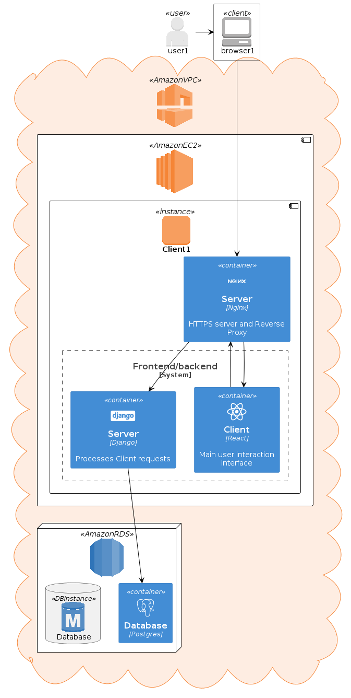

# Simplebox - Protótipo 1

O protótipo 1 da aplicação deve satisfazer os seguintes requisitos:
##  Gerenciamento de Usuários
**RF-1.1:** O sistema deve permitir que os usuários se registrem e criem novas contas.

**RF-1.2:** O sistema deve autenticar os usuários por meio de credenciais de login (nome de
usuário e senha).

**RF-1.3:** O sistema deve permitir que usuários autorizados gerenciem seus perfis (editar
informações, alterar senha).
Propriedades do usuário: Nome completo, username, password, email, imagem do perfil,
descrição e data de criação do usuário.

**RF-1.4:** O sistema deve permitir o logout de usuário

**Templates Frontend**: A aplicação deve permitir a visualização e interação do usuário por meio dos templates de dashboard e perfil de usuário.

**Hospedagem na AWS**:A aplicação deve ser hospedada no ambiente AWS usando o AWS EC2, AWS RDS bem como as devidas credenciais de IAM, configurações de VPC, subnets, grupos de segurança, tabela de rotas devidamente configuradas para permitir a aplicação executando em uma instância do AWS EC2 salvando/recuperando informações de um banco de dados do AWS RDS.

# Arquitetura

Este repositório contém um arquivo bash script chamado `setup.sh` 
que é responsável por configurar uma instância AWS EC2 com AMI Ubuntu 24.04.

O projeto é composto por outros dois repositórios, [simplebox-ui](https://github.com/dragon-cave/simplebox-ui) e [simplebox-api](https://github.com/dragon-cave/simplebox-api), que são, respectivamente, o _frontend_ e o _backend_ do projeto.

O frontend foi escrito em TypeScript, utilizando React. Enquanto o backend foi escrito em Python, utilizando Django.

O script de configuração cria uma [systemd unit](https://www.freedesktop.org/software/systemd/man/latest/systemd.unit.html) para que o servidor de backend seja inicializado junto com o sistema, na porta 8001; realiza a _build_ do projeto de frontend, coloca os arquivos estáticos no local adequado para que o Nginx possa atuar como servidor HTTP.

O script de configuração realiza as seguintes ações:

- Instalação do Python, NodeJS e Nginx.
- Configuração das variáveis de ambiente com interação do usuário para inserir senhas, configurações relacionadas a CORS e segredos para algoritmos de _hashing_.
- Instalação das dependências do backend.
- Criação e ativação de uma [systemd unit](https://www.freedesktop.org/software/systemd/man/latest/systemd.unit.html) para que o servidor de backend seja inicializado junto com o sistema, na porta 8001.
- Configuração das variáveis de ambiente com interação do usuário para inserir a URL do backend.
- Realização da _build_ do frontend, gerando arquivos estáticos em `./dist`
- Mover os arquivos estáticos para a localização adequada e ajustar para serví-los por meio do Nginx.
- Interação do usuário para configuração do [template](/nginx.conf) de configuração do Nginx.
- Criação de certificado SSL auto-assinado para permitir o uso de HTTPS (com TLS). **IMPORTANTE**: Isso não é uma boa prática, o ideal seria comprar um certificado de uma entidade certificadora. A finalidade desse certificado auto-assinado é permitir a criptografia das mensagens, pois está sendo utilizado um ambiente em nuvem e as mensagens não devem passar em claro.
- Ativação do Nginx, servindo os arquivos estáticos do frontend na porta 443 (HTTPS) e o servidor Django (Gunicorn) na porta 8000 (proxy reverso para a porta 8001).

As configurações da nuvem devem seguir a política de privilégio mínimo: fornecer o mínimo de permissões apenas para garantir o funcionamento adequado do projeto. Portanto, o RDS não deve ter acesso público e deve ser conectado apenas à instância EC2 que irá executar o projeto. Além disso, o grupo de segurança da instância deve ter como _inbound rules_ a permissão para acessar as portas TCP 443 (HTTPS) e 8000 (API) de qualquer local IPv4, qualquer outro tráfego deve ser bloqueado.