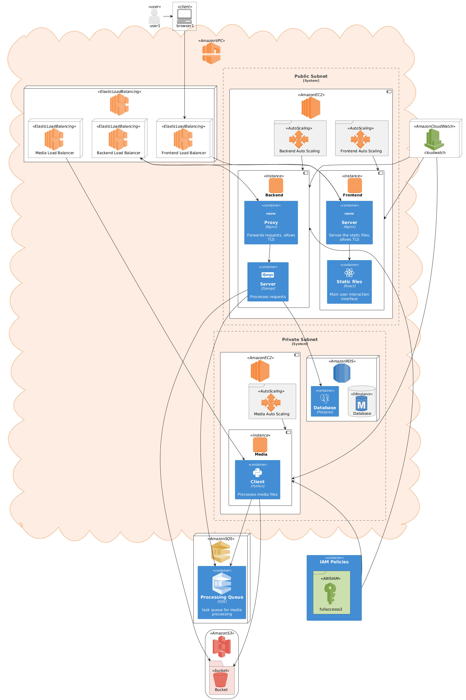

# Simplebox - Protótipo 2

O protótipo 1 da aplicação deve satisfazer os seguintes requisitos:
## 1 Gerenciamento de Usuários
**RF-1.1:** O sistema deve permitir que os usuários se registrem e criem novas contas.

**RF-1.2:** O sistema deve autenticar os usuários por meio de credenciais de login (nome de
usuário e senha).

**RF-1.3:** O sistema deve permitir que usuários autorizados gerenciem seus perfis (editar
informações, alterar senha).
Propriedades do usuário: Nome completo, username, password, email, imagem do perfil,
descrição e data de criação do usuário.

**RF-1.4:** O sistema deve permitir o logout de usuário

**Templates Frontend**: A aplicação deve permitir a visualização e interação do usuário por meio dos templates de dashboard e perfil de usuário.

**Hospedagem na AWS**:A aplicação deve ser hospedada no ambiente AWS usando o AWS EC2, AWS RDS bem como as devidas credenciais de IAM, configurações de VPC, subnets, grupos de segurança, tabela de rotas devidamente configuradas para permitir a aplicação executando em uma instância do AWS EC2 salvando/recuperando informações de um banco de dados do AWS RDS.

## 2 Gerenciamento de objetos multimídia
**RF-2.1:** O sistema deve permitir que usuários autorizados façam upload de novas imagens,
arquivos de áudio e arquivos de vídeo, suportando os seguintes tipos principais:

- Imagens: JPEG (JPG), PNG, GIF, SVG, WebP (formatos adicionais podem ser suportados com base em necessidades futuras)

- Áudio: MP3, WAV, OGG, FLAC (formatos adicionais podem ser suportados com base em necessidades futuras)

- Vídeos: MP4, AVI, MOV, WebM (formatos adicionais podem ser suportados com base em necessidades futuras)

**RF-2.2:** O sistema deve armazenar objetos multimídia carregados com segurança.

**RF-2.3:** O sistema deve permitir que usuários autorizados visualizem objetos multimídia existentes.

**RF-2.4:** O sistema deve permitir que usuários autorizados editem informações e conteúdo de
objetos existentes (por exemplo, renomear, atualizar descrições, adicionar tags).
**RF-2.5:** O sistema deve permitir que usuários autorizados excluam objetos multimídia indesejados.

## 3 Processamento de Imagens
**RF-2.6:** Após o upload de uma imagem, o sistema deve gerar automaticamente uma miniatura (thumbnail).

**RF-2.7:** A miniatura gerada deve ser usada para fins de visualização em listagens e outros contextos relevantes.

## 3.1 Propriedades da imagem:
**Nome do arquivo:** O nome do arquivo enviado.

**Tamanho do arquivo:** O tamanho do arquivo enviado em bytes.

**Data de upload:** A data e hora em que o arquivo foi enviado para o sistema.

**Tipo MIME:** O tipo de mídia do arquivo de imagem (por exemplo, image/jpeg, image/png).

#### Propriedades específicas da imagem:
**Dimensões:** Largura e altura da imagem em pixels.

**Profundidade de cor:** O número de bits usados para representar informações de cor emcada pixel 
(por exemplo, 24 bits para cor verdadeira).

**Resolução:** O número de pixels por unidade linear (por exemplo, DPI - pontos por polegada).

**Dados Exif:** Se a imagem contiver dados Exif incorporados, o sistema poderá extrair
informações como modelo da câmera, configurações de exposição, data/hora da captura e localização GPS
(se disponível).

#### Propriedades definidas pelo usuário:
**Descrição:** Uma descrição textual fornecida pelo usuário sobre a imagem.

**Tags:** Palavras-chave ou rótulos atribuídos pelo usuário para categorizar a imagem.

## 3.2.2 Processamento de Vídeos
**RF-2.8:** Após o upload de um vídeo, o sistema deve gerar automaticamente uma miniatura a partir do primeiro quadro do vídeo.

**RF-2.9:** A miniatura gerada deve ser usada para fins de visualização em listagens e outros contextos relevantes.

**RF-2.10:** O sistema deve ser capaz de processar arquivos de vídeo enviados e criar versões
adicionais com diferentes qualidades de vídeo, incluindo: 1080p, 720p e 480p.

**RF-2.11:** Cada qualidade de vídeo gerada deve estar associada ao arquivo de vídeo original,
permitindo que os usuários selecionem a qualidade desejada durante a reprodução. A resolução padrão ao carregar um vídeo selecionado será de 1080p.

#### Propriedades do vídeo
**Nome do arquivo:** O nome do arquivo enviado.

**Tamanho do arquivo:** O tamanho do arquivo enviado em bytes.

**Data de upload:** A data e hora em que o arquivo foi enviado para o sistema.

**Tipo MIME:** O tipo de mídia do arquivo de vídeo (por exemplo, video/mp4, video/avi).

#### Propriedades específicas do vídeo:
**Duração:** O comprimento do vídeo em segundos ou minutos.

**Resolução do vídeo:** A largura e a altura do vídeo em pixels (por exemplo, 1920x1080 para Full HD).

**Taxa de quadros:** O número de quadros exibidos por segundo, afetando a suavidade do vídeo (por exemplo, taxas de quadros mais altas criam visuais mais suaves).

**Codec de vídeo:** O método de compressão usado para codificar os dados de vídeo, impactando o tamanho do arquivo e a qualidade (por exemplo, H.264, VP9).

**Codec de áudio:** O método de compressão usado para codificar os dados de áudio dentro do arquivo de vídeo.
**Taxa de bits:** A taxa de bits combinada dos fluxos de áudio e vídeo, indicando o tamanho geral do arquivo e a qualidade.

**Localização da miniatura:** O caminho ou identificador para a imagem da miniatura gerada associada ao vídeo.

**Detalhes do processamento:** Informações sobre o processamento de vídeo realizado pelo sistema, como:
- Versões de qualidade de vídeo geradas: Detalhes sobre as versões criadas com diferentes resoluções (por exemplo, 1080p, 720p, 480p) e suas respectivas localizações.

#### Propriedades definidas pelo usuário:
**Descrição:** Uma descrição textual fornecida pelo usuário sobre o vídeo.

**Tags:** Palavras-chave ou rótulos atribuídos pelo usuário para categorizar o vídeo.

**Gênero:** A categoria de gênero do vídeo (por exemplo, filme, videoclipe musical, educacional).

## 4 Processamento de Áudio
Propriedades comuns a áudios que a aplicação deve armazenar.
**Nome do arquivo:** O nome do arquivo enviado.

**Tamanho do arquivo:** O tamanho do arquivo enviado em bytes.

**Data de upload:** A data e hora em que o arquivo foi enviado para o sistema.

**Tipo MIME:** O tipo de mídia do arquivo de áudio (por exemplo, áudio/mpeg, áudio/wav). Propriedades específicas do áudio:

**Duração:** O comprimento do arquivo de áudio em segundos ou minutos.

**Taxa de bits:** O número de bits processados por segundo, indicando qualidade de áudio e tamanho do arquivo (por exemplo, taxas de bits mais altas geralmente correspondem a melhor qualidade de áudio e arquivos maiores).

**Taxa de amostragem:** O número de amostras retiradas por segundo, afetando a fidelidade do áudio (por exemplo, taxas de amostragem mais altas capturam mais detalhes, mas resultam em arquivos maiores).

**Canais:** O número de canais de áudio (por exemplo, mono para um único canal, estéreo para dois canais).

#### Propriedades definidas pelo usuário:
**Descrição:** Uma descrição textual fornecida pelo usuário sobre o arquivo de áudio.

**Tags:** Palavras-chave ou rótulos atribuídos pelo usuário para categorizar o arquivo de áudio.

**Gênero:** O gênero musical do arquivo de áudio (se aplicável).

## 5 Funcionalidade de Pesquisa
**RF-3.1:** O sistema deve permitir que os usuários pesquisem objetos multimídia usando palavras-chave relacionadas a:
- **Descrição:** Descrição textual associada ao objeto.

- **Nome:** Nome do arquivo do objeto.

- **Tags:** Palavras-chave definidas pelo usuário atribuídas ao objeto.

**RF-3.2:** O sistema deve exibir resultados de pesquisa com base nas palavras-chave inseridas.

## 6 Funcionalidade de Listagem
**RF-4.1:** O sistema deve fornecer opções para listar todos os objetos multimídia no sistema.

**RF-4.2:** O sistema deve fornecer opções para listar objetos com base em seu tipo (imagens,áudio vídeos).

**RF-4.3:** O sistema deve permitir que os usuários combinem palavras-chave de pesquisa com opções de listagem para filtrar ainda mais os resultados.

## 7 Funcionalidade de Visualização
**RF-5.1:** O sistema deve permitir que os usuários selecionem um objeto de uma lista.

**RF-5.2:** O sistema deve exibir o conteúdo completo e os detalhes do objeto selecionado com
base em seu tipo (por exemplo, exibir imagem para objeto de imagem, reproduzir áudio para objeto de áudio, reproduzir vídeo para objeto de vídeo).

## 8 Requisitos Não Funcionais
**Desempenho:** O sistema deve ter tempos de resposta aceitáveis (a definir com o cliente) para todas as funcionalidades.

**Segurança:** O sistema deve implementar medidas de segurança (cada usuário só tem acesso a seus próprios objetos multimídia) para proteger dados de usuários e conteúdo multimídia.

**Escalabilidade:** O sistema deve ser capaz de lidar com um número crescente de usuários e objetos sem degradação significativa de desempenho (baseado nos tempos de respostas definidos junto ao cliente).

**Usabilidade:** A interface do usuário deve ser intuitiva (preferencialmente responsiva) e fácil de usar para os usuários.

# Arquitetura

Este repositório contém um arquivo bash script chamado `setup.sh` 
que é responsável por configurar uma instância AWS EC2 com AMI Ubuntu 24.04.

O projeto é composto por outros dois repositórios, [simplebox-ui](https://github.com/dragon-cave/simplebox-ui) e [simplebox-api](https://github.com/dragon-cave/simplebox-api), que são, respectivamente, o _frontend_ e o _backend_ do projeto.

O frontend foi escrito em TypeScript, utilizando React. Enquanto o backend foi escrito em Python, utilizando Django.

O script de configuração cria uma [systemd unit](https://www.freedesktop.org/software/systemd/man/latest/systemd.unit.html) para que o servidor de backend seja inicializado junto com o sistema, na porta 8001; realiza a _build_ do projeto de frontend, coloca os arquivos estáticos no local adequado para que o Nginx possa atuar como servidor HTTP.

O script de configuração realiza as seguintes ações:

- Instalação do Python, NodeJS e Nginx.
- Configuração das variáveis de ambiente com interação do usuário para inserir senhas, configurações relacionadas a CORS e segredos para algoritmos de _hashing_.
- Instalação das dependências do backend.
- Criação e ativação de uma [systemd unit](https://www.freedesktop.org/software/systemd/man/latest/systemd.unit.html) para que o servidor de backend seja inicializado junto com o sistema, na porta 8001.
- Configuração das variáveis de ambiente com interação do usuário para inserir a URL do backend.
- Realização da _build_ do frontend, gerando arquivos estáticos em `./dist`
- Mover os arquivos estáticos para a localização adequada e ajustar para serví-los por meio do Nginx.
- Interação do usuário para configuração do [template](/nginx.conf) de configuração do Nginx.
- Criação de certificado SSL auto-assinado para permitir o uso de HTTPS (com TLS). **IMPORTANTE**: Isso não é uma boa prática, o ideal seria comprar um certificado de uma entidade certificadora. A finalidade desse certificado auto-assinado é permitir a criptografia das mensagens, pois está sendo utilizado um ambiente em nuvem e as mensagens não devem passar em claro.
- Ativação do Nginx, servindo os arquivos estáticos do frontend na porta 443 (HTTPS) e o servidor Django (Gunicorn) na porta 8000 (proxy reverso para a porta 8001).

As configurações da nuvem devem seguir a política de privilégio mínimo: fornecer o mínimo de permissões apenas para garantir o funcionamento adequado do projeto. Portanto, o RDS não deve ter acesso público e deve ser conectado apenas à instância EC2 que irá executar o projeto. Além disso, o grupo de segurança da instância deve ter como _inbound rules_ a permissão para acessar as portas TCP 443 (HTTPS) e 8000 (API) de qualquer local IPv4, qualquer outro tráfego deve ser bloqueado.